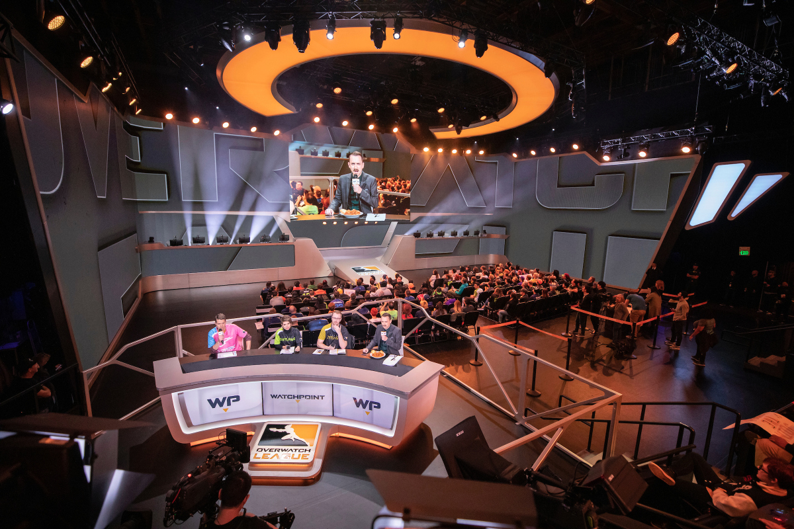

# eGaming

Esports (also known as electronic sports, e-sports, or eSports) is a form of sport competition using video games.

Esports often takes the form of organized, multiplayer video game competitions, particularly between professional players, individually or as teams. Although organized competitions have long been a part of video game culture, these were largely between amateurs until the late 2000s, when participation by professional gamers and spectatorship in these events through live streaming saw a large surge in popularity.

By the 2010s, esports was a significant factor in the video game industry, with many game developers actively designing and providing funding for tournaments and other events.

## Professional eGaming

As e-sports continue to chase mainstream popularity, traditional sports organizations have steadily joined the ranks. Now, some of the biggest professional e-sports leagues in the world are starting to look a lot like the NBA or NFL. 

That includes big-money owners, a structured schedule, and things like minimum salaries and other benefits for players. The transformation started slowly, with European soccer clubs signing professional FIFA players to represent their teams in competition. 

In 2016, the NBA’s Philadelphia 76ers became the first major North American team to get into the field when it acquired [e-sports group Team Dignitas](https://www.theverge.com/2016/9/26/13057934/nba-philadelphia-76ers-buy-esports-team-dignitas).

The key industry players and trends growing the esports market which is on track to [surpass $1.5B by 2023](https://www.businessinsider.com/esports-ecosystem-market-report).

## Betting on eGaming

As one of the fastest growing categories in online gambling, esports betting is on pace to reach up to [$8 billion USD in total wagers this year](https://venturebeat.com/2019/06/03/betting-is-esports-biggest-and-most-underappreciated-opportunity/), equating to $560 million in revenue at an industry average margin of 7%. Growth estimates point to more than $16 billion in annual wagers in coming years.

### Top 10 Gamers on YouTube

Throughout the past fifteen years, YouTube strengthened the Esports community by providing influencers with a platform to engage in and promote gaming content. There are hundreds upon thousands of Esports gamers who are currently uploading videos into their channels for their dedicated fanbases. [However, ten gamers have managed to truly grasp media attention, resulting in the incredible gain of notoriety.](https://www.lineups.com/esports/top-10-gamers-on-youtube/)

**Statistics Around YouTube eGaming**

- 56% of YouTube gamers say YouTube is where they connect with their gaming community.

- 73% of YouTube gamers say they enjoy watching others

### Top 10 Gamers on Twitch

Twitch is the biggest streaming platform for video games and other entertainment, and it is the hub of all things video games in 2020. New games are previewed through the perspective of streamers now and thousands tune in daily to be entertained by the personalities of Twitch. Also, it has become a platform for Esports athletes to show their practice live to their fans and watch their matches from anywhere in the world. [Here is the list of the top 10 Esports streamers on Twitch in 2020.](https://www.lineups.com/esports/top-10-esports-twitch-streamers/)

### Top 10 Gamers on Facebook Gaming

Facebook Gaming is transforming how people stream online. As the social media giant's newest venture, Facebook Gaming is hoping to give Twitch a run for its money.

Microsoft’s choice to partner with Facebook is clearly a strategic one that’s also related to broadening the appeal of its upcoming xCloud game streaming service and its overall gaming efforts. Microsoft will work closely with Facebook to bring xCloud to Facebook Gaming, allowing viewers to click and immediately play games that people are streaming.  [See the top Facebook streamers here.](
https://www.ranker.com/list/best-facebook-gaming-streamers/ranker-games)

# Project: eGaming

eGaming consists of multiple data streams:

- live or recorded video
- live or recorded audio
- live or recorded text chat
- live or saved commenting

In the above data streams, conversations are had around topics around gaming PCs, accessories, tips & tricks to win the game, community discussions around teamwork, and ***hot topics*** around current events.  

 
